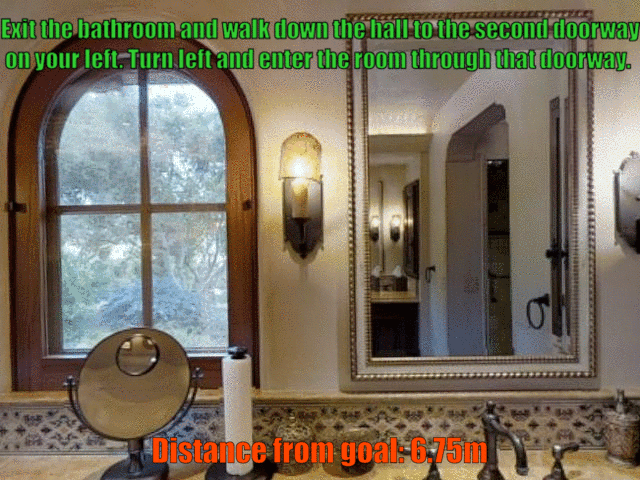
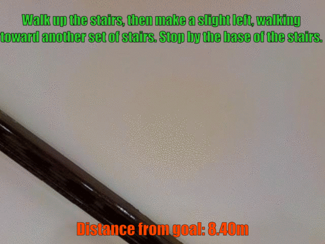
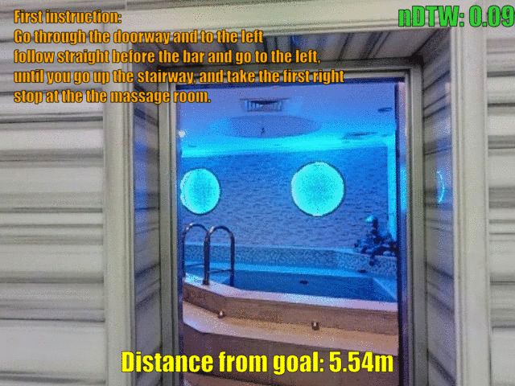

# Perceive, Transform, and Act
This is the PyTorch implementation of our paper:

**Multimodal Attention Networks for Low-Level Vision-and-Language Navigation** ([paper](https://arxiv.org/abs/1911.12377))<br>
__***Federico Landi***__, Lorenzo Baraldi, Marcella Cornia, Massimiliano Corsini, Rita Cucchiara<br>
*Computer Vision and Image Understanding (CVIU), 2021*

## Table of contents
   1. [Installation](#installation)
   2. [Training and Testing](#training-and-testing)
   3. [Visualizing Navigation Episodes](#visualizing-navigation-episodes)
   4. [Reproducibility Note](#reproducibility-note)
   5. [Citing](#citing)
   6. [License](#license)
   7. [Acknowledgments](#acknowledgments)

## Installation

Our repository is based on the [Matterport3D simulator](https://github.com/peteanderson80/Matterport3DSimulator), which was originally proposed with the Room-to-Room dataset.

As a first step, clone the repository and create the environment with conda:

```
git clone --recursive https://github.com/aimagelab/perceive-transform-and-act
cd perceive-transform-and-act

conda env create -f environment.yml
source activate pta
```

If you didn't clone with the `--recursive` flag, then you'll need to manually clone the submodules from the top-level directory:
```
git submodule update --init --recursive
```

### Building with Docker

Please follow the instructions on the [Matterport3DSimulator repository](https://github.com/peteanderson80/Matterport3DSimulator) to install the simulator via Docker.

### Bulding without Docker

A C++ compiler with C++11 support is required. Matterport3D Simulator has several dependencies:
- Ubuntu >= 14.04
- Nvidia-driver with CUDA installed 
- C++ compiler with C++11 support
- [CMake](https://cmake.org/) >= 3.10
- [OpenCV](http://opencv.org/) >= 2.4 including 3.x
- [OpenGL](https://www.opengl.org/)
- [GLM](https://glm.g-truc.net/0.9.8/index.html)
- [Numpy](http://www.numpy.org/)

Optional dependences (depending on the cmake rendering options):
- [OSMesa](https://www.mesa3d.org/osmesa.html) for OSMesa backend support
- [epoxy](https://github.com/anholt/libepoxy) for EGL backend support

If all of the dependecies are installed, you can build the simulator from source by tiping:

```
mkdir build
cd build
cmake -DOSMESA_RENDERING=ON -DPYTHON_EXECUTABLE:FILEPATH=`path/to/your/python/bin` ..
make
```

### Precomputed ResNet Image Features

Download the [precomputed ResNet-152 (imagenet) features](https://www.dropbox.com/s/715bbj8yjz32ekf/ResNet-152-imagenet.zip?dl=1), and place the corresponding .tsv file into the ```img_features``` folder.

## Training and Testing

To train PTA from scratch, move to the root directory and run:

```
python tasks/R2R/main.py --name train_from_scratch \
                         --plateau_sched \
                         --lr 1e-4 \
                         --max_episode_len 30
```

We also provide weights obtained with the training described in the paper. If you wish to reproduce the results in our paper, run:

```
python tasks/R2R/main.py --name test_ll \
                         --max_episode_len 30 \
                         --eval_only \
                         --pretrained \
                         --load_from low_level
```

Our agent can also perform high-level Vision-and-Language Navigation.
To reproduce the results otained with the high-level setup, run:

```
python tasks/R2R/main.py --name test_hl \
                         --high_level \
                         --max_episode_len 10 \
                         --eval_only \
                         --pretrained \
                         --load_from high_level
```

## Visualizing Navigation Episodes

To make our qualitative results easier to visualize, we provide some .gif files that display some of the navigation episodes reported in our paper. We also show meaningful metrics to evaluate our results.

### Low-level VLN in R2R

<p>

  &nbsp; &nbsp;

</p>

### Low-level VLN in R4R

<p>

  &nbsp; &nbsp;

</p>

## Reproducibility Note

Our experiments were made using an Nvidia 1080Ti GPU, CUDA 10.0, and python 3.6.8. Using different hardware setups or software versions may affect results.

## Citing

If you find our code useful for your research, please cite our paper:

#### Bibtex:
```
@article{landi2021multimodal,
  title={Multimodal attention networks for low-level vision-and-language navigation},
  author={Landi, Federico and Baraldi, Lorenzo and Cornia, Marcella and Corsini, Massimiliano and Cucchiara, Rita},
  journal={Computer Vision and Image Understanding},
  year={2021},
  publisher={Elsevier}
}
```

## License
PTA is MIT licensed. See the [LICENSE file](LICENSE) for details.

The trained models are considered data derived from the correspondent scene datasets.

## Acknowledgments
This work has been supported by "Fondazione di Modena" and by the national project "IDEHA: Innovation for Data Elaboration in Heritage Areas" (PON ARS01\_00421), cofunded by the Italian Ministry of University and Research.
